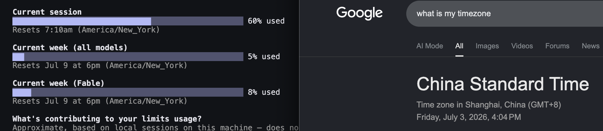

# 🦅🦅🦅CCWestward🤠🤠🤠

🌎 让 Claude Code 在终端中随机切换到**美国时区**运行的轻量级开源 CLI 工具 🌎

CC Westward 是一个很小的终端包装器。首次启动 Claude 时，它会从安全的美国 IANA 时区列表中随机选择一个时区并保存，之后继续复用这个时区，保持一致。它只会给启动出来的 Claude 子进程设置 `TZ`。（不会修改系统时区！）



> [!NOTE]
> ⭐ 如果这个项目对你有帮助，**欢迎 star + fork**，你的支持是持续维护的最大动力！

## 📦 安装

```bash
npm install -g cc-westward
```

安装时会自动把 `claude` 快捷命令写入当前 shell 配置文件（`.zshrc`、`.bashrc`、fish 的 `config.fish`，或 Windows PowerShell profile）：

```bash
alias claude='ccwestward claude'
```

```powershell
function claude { ccwestward claude @args }
```

新开终端后即可直接运行 `claude`。如果不想自动写入别名：

```bash
CCWESTWARD_SKIP_ALIAS=1 npm install -g cc-westward
```

本地开发：

```bash
npm install
npm run build
npm link
```

## 使用

```bash
# 使用随机美国时区运行 Claude
ccwestward

# 显式写法
ccwestward claude

# 透传参数给 Claude
ccwestward claude --dangerously-skip-permissions

# 指定时区
ccwestward --zone America/New_York

# 只预览，不运行
ccwestward --dry-run

# 打印已保存的时区；首次启动前则打印随机预览
ccwestward --print-zone

# 重新随机生成并保存一个允许的时区
ccwestward --reset-zone

# 打开交互式设置
ccwestward --settings

# 打印 shell 别名设置说明
ccwestward init
```

`ccwestward` 默认等同于 `ccwestward claude`，因为最常见的用法就是直接启动 Claude。显式写法适合 shell 别名和更清晰的命令表达。

## Shell 设置

全局安装会自动安装 `claude` 别名。也可以手动运行：

```bash
ccwestward init
```

然后把对应片段加入你的 shell 配置：

```bash
# zsh / bash
alias claude='ccwestward claude'
```

```fish
# fish
alias claude 'ccwestward claude'
```

```powershell
# PowerShell
function claude { ccwestward claude @args }
```

CC Westward 会从 `PATH` 中解析真正的 `claude` 可执行文件，并跳过指向 `ccwestward` 自身的路径，避免别名递归。如果你的 Claude CLI 在自定义位置，可以设置：

```bash
export CCWESTWARD_CLAUDE=/完整/路径/claude
```

## 交互式设置

运行：

```bash
ccwestward --settings
```

可以在终端菜单中修改保存的时区、重新随机生成时区，或安装自定义 shell 别名。别名有两种：

- Claude 别名：例如让 `claude` 指向 `ccwestward claude`
- ccwestward 命令别名：例如让 `cw` 指向 `ccwestward`，原来的 `ccwestward` 命令仍然保留

设置菜单会把别名写入当前 shell 的配置文件，例如 `.zshrc`、`.bashrc` 或 fish 的 `config.fish`。新开终端后会自动生效；如果想在当前终端马上使用，请运行菜单最后打印的 `source ...` 命令。

设置菜单也提供“重置所有设置”：删除已保存的时区，并移除 CC Westward 写入 shell 配置文件的别名块。

## 时区

允许的时区：

```text
America/New_York
America/Detroit
America/Kentucky/Louisville
America/Chicago
America/Indiana/Indianapolis
America/Denver
America/Phoenix
America/Boise
America/Los_Angeles
America/Anchorage
Pacific/Honolulu
```

传入其他时区会失败，并显示允许的时区列表。

## 开发

```bash
npm install
npm run build
npm test
npm run lint
```

## 许可证

MIT
